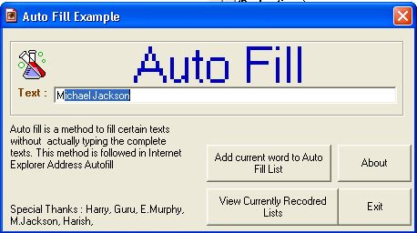



## TEXT Auto Filler Xp \( Like IE address autofill\)

### Description

READ THIS : Text Auto Filler works like Internet Explorer's Address auto fill. This program uses a API CALL which is used in Internet Explorer. Auto fill is a method to fill certain texts without actually typing the complete texts. The program srikes an API CALL every time a correct letters combination recorded in the HISTORY DATABASE is detected and fills the textbox with Recorded word. Have a look at screenshot . There are also HISTORY VIEWER and modifier. If a word is not found in the HISTORY then you can add the word to History database. Database actually do not use any database programming, its a simple program. This program will also be really useful while handling large searches and Database Searches. This program has no bugs and fully tested and it works fine. And thats not all- this program uses very easily understandable code. Therefore this program is really useful. Don't forget to Vote For ME
 
### More Info
 

             |
---                |---
**Submitted On**   |2003-02-22 14:50:40
**By**             |[Sriharish\.H](https://github.com/Planet-Source-Code/PSCIndex/blob/master/ByAuthor/sriharish-h.md)
**Level**          |Beginner
**User Rating**    |4.2 (25 globes from 6 users)
**Compatibility**  |VB 5\.0, VB 6\.0
**Category**       |[Internet/ HTML](https://github.com/Planet-Source-Code/PSCIndex/blob/master/ByCategory/internet-html__1-34.md)
**World**          |[Visual Basic](https://github.com/Planet-Source-Code/PSCIndex/blob/master/ByWorld/visual-basic.md)
**Archive File**   |[TEXT\_Auto\_1548852222003\.zip](https://github.com/Planet-Source-Code/sriharish-h-text-auto-filler-xp-like-ie-address-autofill__1-43446/archive/master.zip)

